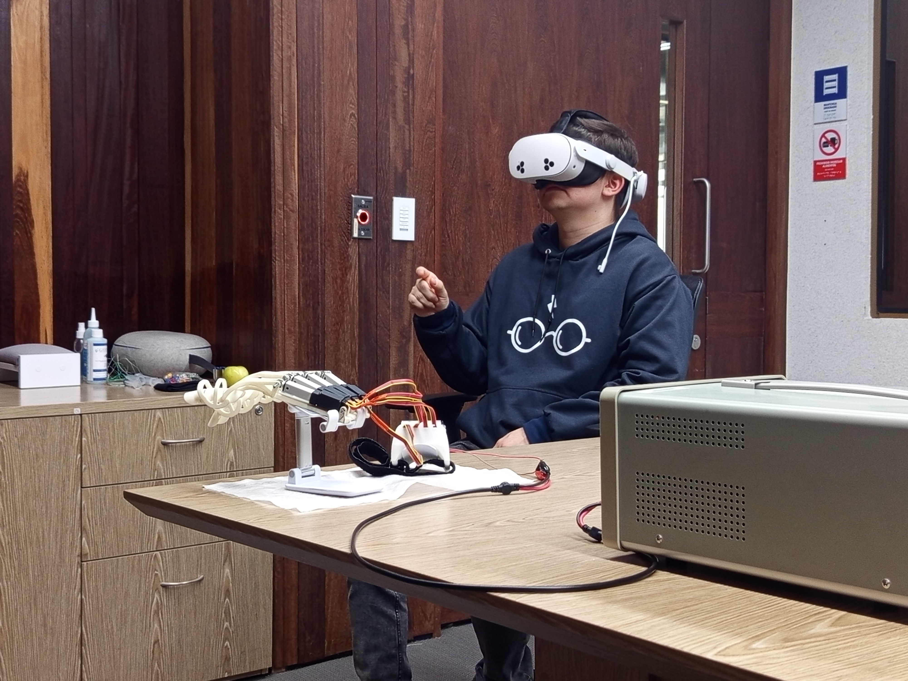

# Mixed Reality Interface and Rehabilitation Game Design for a Robotic Exoskeleton

## Description

This repository contains the development of the project titled **“Mixed Reality Interface and Rehabilitation Game Design for a Robotic Exoskeleton.”**  
The goal of this project is to address the challenges faced by patients recovering from a cerebrovascular accident (CVA/stroke) through the use of innovative technologies such as Mixed Reality (MR) and a robotic exoskeleton.

### Background

Cerebrovascular accidents are one of the leading causes of disability worldwide. Rehabilitation is essential for improving patients’ quality of life, yet significant barriers limit access to effective treatments. This project focuses on creating a system that combines a robotic exoskeleton with an MR interface to enhance upper-limb rehabilitation, supporting both motor and cognitive recovery.

## Objective

The main objective of this project is to develop a mixed-reality environment that can integrate with a robotic exoskeleton and serve as a support tool in the post-stroke rehabilitation process. This includes:

- Creating a digital twin of the exoskeleton.  
- Establishing bidirectional communication between the exoskeleton and the MR headset.  
- Designing an interactive game to stimulate hand and upper-limb motor recovery.

## Features

This repository includes:

- Source code for the development of the mixed reality interface.  
- Digital twin tests.  
- Bluetooth Low Energy (BLE) communication implementations.  
- Resources for the design and evaluation of the rehabilitation game.
- Images of the implementation and the tests with users.

### User Interaction Example

Below are images showing the system in use:

#### User wearing the MR headset

## Usage

This repository is intended for researchers, developers, and rehabilitation professionals interested in integrating advanced technologies into post-stroke recovery processes. The system aims to improve the effectiveness of rehabilitation therapies and expand access to innovative treatment options.

## Contributions

Contributions are welcome. If you would like to collaborate, please open an **issue** or submit a **pull request**.

## Project Members

- [David Esteban González Rozo](https://github.com/tu-usuario1) <!-- REPLACE WITH CORRECT LINKS -->
- [Jerónimo Rueda Giraldo](https://github.com/tu-usuario2)
- [Guillermo Andrés Aguilera Hurtado](https://github.com/tu-usuario3)

**Advisor**: [Iván Mondragón Bernal, PhD.](https://github.com/tu-usuario4)  
**Co-Advisor**: [Julian Colorado Montaño, PhD.](https://github.com/tu-usuario5)  
**Consultant**: [Wilson Alonso Hernandez Martinez](https://github.com/tu-usuario6)

